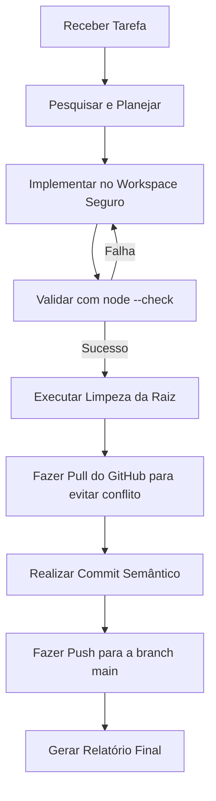

# Regras Operacionais Permanentes de Sincronização e Operação IA

Este documento define as regras mandatórias para qualquer Inteligência Artificial (incluindo Antigravity, Codex e futuros agentes) ao manipular arquivos, realizar commits e sincronizar este repositório com o GitHub.

---

## 1. Regras Operacionais Críticas

### 1.1. Validação de Sintaxe Pré-Commit
* Antes de preparar qualquer commit, a IA **deve obrigatoriamente** testar a integridade sintática dos arquivos JavaScript modificados utilizando a engine do Node.js local.
* O comando de verificação deve ser:
  ```powershell
  node --check background.js
  node --check content.js
  node --check popup.js
  ```
* Se qualquer arquivo falhar na verificação sintática, o commit **não deve ser realizado** até que a falha seja completamente sanada.

### 1.2. Limpeza Absoluta da Raiz Carregável
* A pasta `chat_bridge_ext_v0_3_2/` é a raiz carregável oficial da extensão Chrome e deve permanecer **100% limpa**.
* **Permitidos na raiz:** `manifest.json`, `background.js`, `content.js`, `popup.html`, `popup.js`, `popup.css`, ícones (`*.png`) e `README.md`.
* **Proibidos na raiz:** arquivos `.bak`, relatórios de progresso, handoffs, pastas temporárias, pastas iniciadas por `_` (reservadas pelo Chrome) ou backups locais.
* Qualquer backup ou arquivo de planejamento deve ser salvo fora da raiz da extensão, no diretório `backups/` na raiz do projeto.
* A IA deve inspecionar a raiz carregável executando `Get-ChildItem` antes de sinalizar prontidão para teste.

### 1.3. Prevenção Contra Vazamento de Credenciais
* **Segurança Absoluta:** É expressamente proibido versionar ou fazer commit de arquivos que contenham senhas, tokens de API, chaves de autenticação, cookies, sessões ou qualquer dado sensível pessoal ou corporativo.
* A IA deve realizar uma varredura de segurança nos arquivos novos ou alterados antes de qualquer `git add` para confirmar que nenhuma credencial de desenvolvimento ou produção está exposta.

### 1.4. Preservação da Pasta Ativa do Chrome
* A pasta ativa carregada no Chrome do usuário (`C:\Users\Windows User\Documents\Chrome_Extensoes\ChatBridge`) é uma zona segura e operacional de produção local.
* O Git **nunca** deve interagir, monitorar, alterar ou gerenciar essa pasta ativa diretamente.
* As atualizações da pasta ativa só devem ocorrer mediante deploy manual ou via script de instalação específico autorizado pelo usuário, nunca por meio de comandos automáticos do git.

---

## 2. Padrão de Versionamento e Commits

Todos os commits gerados neste repositório devem seguir rigidamente o padrão de Commits Semânticos adaptados para o projeto:

* **Novas Funcionalidades:** `feat(v0.3.2): <descrição concisa em português>`
* **Correções de Bugs:** `fix(v0.3.2): <descrição concisa em português>`
* **Documentação:** `docs: <descrição concisa em português>`
* **Organização/Refatoração:** `refactor: <descrição concisa em português>`

*Exemplo de commit válido:*
`feat(v0.3.2): implementa grupos de botoes colar e trazer com atalhos de teclado`

---

## 3. Fluxo de Trabalho Seguro para Inteligências Artificiais

Ao assumir qualquer tarefa no projeto, a IA deve seguir este protocolo:



1. **Pull Inicial:** Sempre faça pull do remoto (`main`) antes de criar novos arquivos ou commits para garantir sincronia e evitar apagamentos acidentais de arquivos existentes no cofre.
2. **Garantia de .gitignore:** Certifique-se de que o `.gitignore` na raiz esteja ativo e atualizado para bloquear pastas de backup locais, arquivos temporários e ZIPs de empacotamento.
3. **Auditabilidade:** Após o push, a IA deve entregar um relatório detalhado contendo o commit SHA e a lista precisa de arquivos sincronizados.
